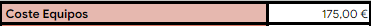
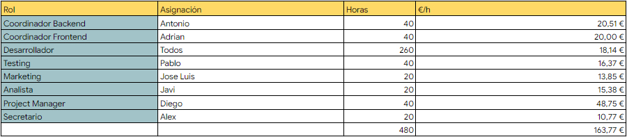
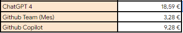
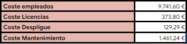
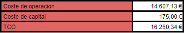
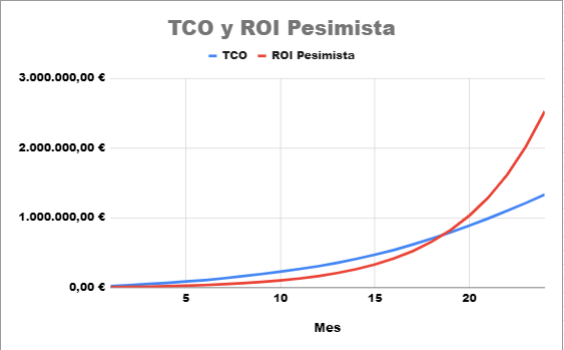
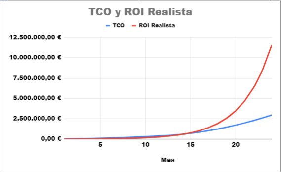
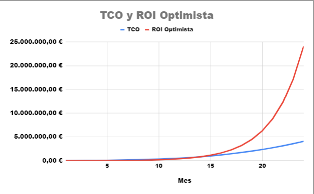

# Analisis de Costes - Ciao Lavoro

## Miembros del equipo y contribuciones
| Nombre y Apellidos  | Tipo de Contribución  |
|---------------------|-----------------------|
| Antonio Barea       | Creación/Redacción   |
| Javier Grosso      | Revisión  |

### CONTROL DE VERSIONES
| FECHA      | VERSIÓN | DESCRIPCIÓN                                      |
|------------|---------|--------------------------------------------------|
| 01/04/2024 | 1.0     | Creación del documento                           |

1. Introducción:

    En este documento se realizará un analisis del Coste Total de Propiedad (TCO) del Proyecto CiaoLavoro, además, se realizará un análisis optimista, realista y pesimista del Retorno de Inversión (ROI) del proyecto en 24 meses.

2. TCO

    El **Coste Total de propiedad** o **TCO** se refiere al costo total asociado con la adquisición, implementación, operación y mantenimiento del proyecto durante su ciclo de vida completo e incluye todos los costos directos e indirectos relacionados con la propiedad.

    El TCO lo hemos dividido en dos partes:

    **Coste de Capital:** son los costos asociados con la adquisición de activos que se utilizan en el proceso de desarrollo, implementación y puesta en marcha de la aplicación.

    

    En nuestro caso, los unicos costes de capital son los propios ordenadores que usará el equipo de desarrollo a lo largo del ciclo de vida del proyecto.

    **Coste de Operacion:** son los costos recurrentes necesarios para operar y mantener la aplicación una vez que está en funcionamiento.

    

    En la imagen anterior podemos ver el coste del equipo de desarrollo por cada hora de trabajo junto con el total de horas.

    

    En la imagen anterior podemos ver los 3 licencias que se usaran en el desarrollo. Cabe destacar el uso de la licencia de GitHub Team para poder utilizar la herramienta GitHub Actions sin preocuparse por las limitaciones.

    

    Este sería un resumen final del gasto mensual de operación de la aplicación.

    Finalmente, el TCO quedaría de la siguiente manera:

    

2. ROI

    El **Retorno de Inversión** o **ROI** es una medida financiera que se utiliza para evaluar el rendimiento o la rentabilidad de una inversión en relación con su costo.

    El beneficio de nuestra aplicación se obtiene mediante un porcentaje del precio de las contrataciones y las subscripciones que se realicen. La aplicación se queda con un 15% del precio del contrato.Teniendo en cuenta que el valor de los contratos medios se estima en 30€, el beneficio de la aplicacion por contrato será de unos 4.5€ y el beneficio por subscripción es de 5€. Por lo tanto, suponiendo que el primer mes se realizan 200 contrataciones y 50 subscripciones el ROI variará en las siguientes 3 alternativas:

    **ROI Pesimista** 

    

    En esta alternativa, los contratos y subscripciones aumentan un 25% cada mes. Llegando a ser el porcentaje de retorno de un 89,62% en el mes 24.

    Cabe destacar que el TCO aumenta progresivamente debido a la cantidad de usuarios que usan la aplicación, provocando así, la necesidad de más empleados, más ordenadores y un mayor servidor.

    **ROI Realista**

    

    En esta alternativa, los contratos y subscripciones aumentan un 35% cada mes. Llegando a ser el porcentaje de retorno de un 290,10% en el mes 24.

    Cabe destacar que el TCO aumenta progresivamente debido a la cantidad de usuarios que usan la aplicación, provocando así, la necesidad de más empleados, más ordenadores y un mayor servidor.

    **ROI Realista**

    

    En esta alternativa, los contratos y subscripciones aumentan un 45% cada mes. Llegando a ser el porcentaje de retorno de un 491.72% en el mes 24.

    Cabe destacar que el TCO aumenta progresivamente debido a la cantidad de usuarios que usan la aplicación, provocando así, la necesidad de más empleados, más ordenadores e incluso llegando a necesitar varios servidores con mejor rendimiento.
