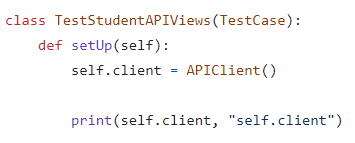


**ISPP                         GESTIÓN DE LA CONFIGURACIÓN\_\_\_             \_\_\_\_Grupo-6** 

Gestión de los testeos.

CiaoLavoro

MIEMBROS DEL EQUIPO:

-Alexander | Alicia Sánchez Hossdorf

\- Álvaro Hidalgo Rodríguez

\- Joaquín Arregui Díaz

\- Samuel Albalat Ortiz

\- Adrián García Chavero

\- Pablo Cuenca Pérez

\- Francisco Antonio Campos Campos

\- Javier Grosso

\- José Luis Cobo Ariza

\- Diego González Quintanilla

\- Antonio Barea Jiménez

\- Pablo Mateos Angulo

INGENIERÍA DEL SOFTWARE Y PRÁCTICA PROFESIONAL

GRUPO 6 | SEVILLA, 15 DE MARZO 2024 | 

ENTREGABLE “SPRINT 2”

**CONTROL DE VERSIONES**	

|**FECHA**|**VERSIÓN**|**DESCRIPCIÓN**|
| - | - | - |
|15/03/2024|1\.0|Primera versión|
||||
||||

Página  PAGE 1 de 9

**ISPP**
![ref1]![ref2]![ref3]
**ISPP                         GESTIÓN DE LA CONFIGURACIÓN\_\_\_             \_\_\_\_Grupo-6** 

![ref1]

**ÍNDICE**

Contenido

[**Introducción.	4**](#_heading=h.83api1jeupbe)**

[**Testing en Backend	4**](#_heading=h.w90sfbc2kusj)

[**Testing en Frontend	4**](#_heading=h.55ar5i9ws06d)
#
#
#
#
#
#
#
#
#
#
#
#

Página  PAGE 2 de 9

**ISPP**

![ref3]![ref1]![ref2]

**ISPP                         GESTIÓN DE LA CONFIGURACIÓN\_\_\_             \_\_\_\_Grupo-6**

**DATOS GENERALES DEL PROYECTO**

|**NOMBRE DEL PROYECTO:**|CiaoLavoro|
| - | - |
|**FECHA DE ELABORACIÓN:**|A 15 de Marzo de 2024|
|**ELABORADO POR:**|Grupo 6|

1. # **Introducción.**
   Este documento pretende ser una guía para hacer un testing sencillo de nuestra aplicación.

   En la parte de backend haremos comprobaciones similares a las que se pueden hacer herramientas como Thunderclient. 

   El objetivo de realizar estas labores de testing no es trabajar por trabajar.

   La idea que perseguimos al realizar estas labores de testing es poder darnos cuenta de que algo que funcionaba ha dejado de funcionar y para cargar el workflow de github con un grupo de testeos que tengan que ser superados antes de realizar cargas de código de develop.

   Para ello se va a elaborar esta guía a seguir para realizar los testeos.

   Al final del documento se dejarán los enlaces a videos, playlists y documentación de donde se ha recogido la información en caso de que surjan dudas.

#

1. # **Testing en Backend.**

   Como sabemos para el trabajo en backend estamos utilizando el Rest Framework de Django para hacer llamadas a las APIs.

   Para testear las APIViews, y si queréis también se puede usar para probar los modelos, haremos uso de Mixer.

   Mixer es una herramienta integrada en Django que facilita enormemente las tareas de testing. Gracias a Mixer puedes generar instancias de modelos, llamadas urls, probar parámetros de entrada y más.

   En este documento vamos a recoger como testear únicamente las APIViews pues es lo que nos interesa.

   Las funcionalidades que tenemos que probar a lo largo del proyecto son las CRUD. Todas ellas se van a testear de maneras muy parecidas.

   Analizaremos una secuencia de testing básica que nos enseñará la base. En los artículos adjuntos se podrá ver cómo hacer testing de funciones más avanzadas.

   Pongámonos en situación. Hemos creado el siguiente modelo:

   

   

`	`Y, sabiendo que usamos el rest\_framework, hemos creado las siguientes vistas:

Con las siguientes URLs:

Y con el siguiente serializer:

`	`

`	`Ahora que ya tenemos la base, comenzamos a montar nuestro tests.py.

`	`Creamos nuestra clase a la que llamaremos TestStudentAPIViews(TestCase) donde definiremos las distintas funciones de testing. La primera función que deberemos definir es la de setUp:

`	`

El APIClient del Rest Framework nos permite logearnos en la API. Ese login que estamos viendo con el APIClient **NO** va a funcionar sin más. Nosotros utilizamos tokens para mantenernos logeados. 

Con ese extra a añadir ya deberíamos tener el setUp listo para nuestros tests.

A continuación mostramos el ejemplo de un setUp mas parecido a lo que debemos hacer en nuestra aplicación para evitar confusiones:

En primer lugar testeamos el listado de estudiantes.

Creamos dos estudiantes haciendo uso de mixer:

A continuación debemos llamar a la URL de la lista de estudiantes que hemos definido en nuestro urls.py. Para ello solo debemos hacer uso de la siguiente línea donde llamadas al “name” que hemos definido al declarar el path:

Y ahora llamamos a la URL a través de nuestro cliente definido para que nos devuelva los datos que tienen almacenado:

Ahora que ya tenemos la respuesta almacenada en nuestra variable “response” solo tenemos que comprobar su contenido con los clásicos “assert”, en el ejemplo comprueba que no esté vacío, que su tamaño sea dos (Hemos creado dos estudiantes) y que el status sea 200:

Finalmente dejamos una imagen de la función completa:

Continuando con el create, la mecánica es parecida. Iniciamos definiendo la función:

A continuación, debemos definir un JSON que representa la información que tiene que recibir la función de creación de un estudiante. En nuestro caso de ejemplo se ve de la siguiente manera:

A partir de aquí la mecánica es la misma. Debemos llamar la url con la función “reverse” y el nombre de la url:

` `Llamar la respuesta de la url (en este caso hacemos un post e incluimos el JSON que hemos definido):

Y comprobarla con los assert, en este caso probamos el 201 porque es el código de creación correcta:

Dejamos una foto de la función completa:

Ahora continuaremos con la vista de detalles de un estudiante. La mecánica es muy parecida, pero en este caso necesitamos la id del estudiante para entrar en los detalles. 

Este id lo conseguimos al tener una creación ligeramente diferente con el mixer en la que incluimos un valor para su pk. Para ello usaremos los kwargs para indicarle a reverse de que estudiante queremos sus detalles:

Los assert se mantienen iguales. En este caso volvemos a buscar un 200 ya que estamos ante un get:

FInalmente dejamos la función completa:

Para terminar repasaremos brevemente el delete. No vamos a indagar ya que es la misma idea que en la vista de detalle. Mostraremos su función completa donde se observa esto mismo:

1. # **Testing en Frontend.**

**APROBACIÓN**	

|**Nombre**|**Cargo**|**Firma**|**Fecha**|
| - | - | - | - |
|

Francisco Antonio Campos
|

Coordinador de Documentación
|

|

10/02/2024
|

Página  PAGE 5 de 9

**ISPP**

![ref3]![ref1]![ref2]

[ref1]: Aspose.Words.b3f528c8-ee73-4ed4-80e7-4211abfa77c7.004.png
[ref2]: Aspose.Words.b3f528c8-ee73-4ed4-80e7-4211abfa77c7.005.png
[ref3]: Aspose.Words.b3f528c8-ee73-4ed4-80e7-4211abfa77c7.006.png
