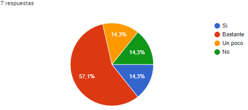
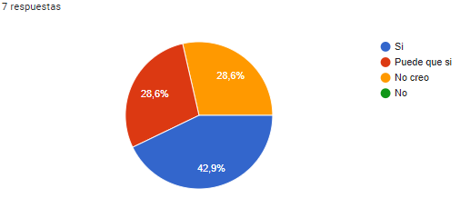
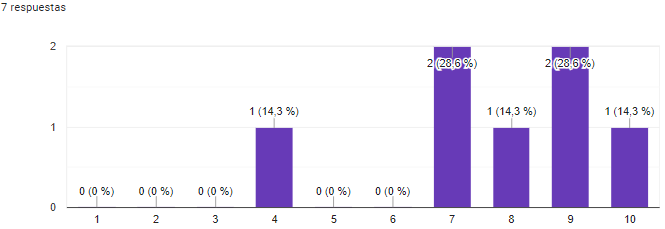

# USUARIOS PILOTO

## CIAOLAVORO
**Grupo 6**
**Entregable: WPL**

## Miembros del equipo y contribuciones

| Nombre y Apellidos  | Tipo de Contribución  |
|---------------------|-----------------------|
| Antonio Barea Jiménez| Redacción             |

### CONTROL DE VERSIONES
| FECHA      | VERSIÓN | DESCRIPCIÓN                                      |
|------------|---------|--------------------------------------------------|
| 13/05/2024 | 1.0     | Creación del documento en su versión WPL    |

### FEEDBACK USUARIOS PILOTO GRUPO 12

- URL de tiempo en clockify : [https://app.clockify.me/shared/664249b3c162f670209b8513](https://app.clockify.me/shared/664249b3c162f670209b8513)

#### ¿Cree que se ha mejorado la aplicación considerablemente?

#### ¿Cree que es útil la aplicación?

#### Grado de satisfacción con la aplicación (siendo 1 el más bajo y 10 el más alto)

#### Alejandro Santiago Félix
Fecha: 12/05/2024

|  | ERRORES ENCONTRADOS | VALIDACIONES | RECOMENDACIONES DE MEJORA |
| -------------- | -------------- | -------------- | -------------- |
| USUARIO | Revisar el regex, la contraseña GTQCg4U+38DaqnJ$ falla pero si le quitas el + funciona | - | - |
| SERVICIO | Si introduzco números excesivamente grandes se me queja del formato, pero si disminuyo el tamaño si me dice el  error del límite, por ejemplo. 9999999999999999999999999.00. Si modifico la session id peta la aplicación al promocionar un servicio y ¿parar que sirve points en la url? Si pongo lo siguiente se quita el promocionar servicio en cualquier servicio session_id=cs_test_a1qOCQDRLoIEG8I9k1FdCb7hOzhyYqdkOMe6q5HX8FVpXLJeomROESuAAr&points=0. Permite crear trabajos y servicios demasidos rápido, quizás debería de ser cada x tiempo poder crear x cantidad de trabajo. | - | - |
| CONTRATO | El error devuelto es incorrecto, 0.0000001 es un número y es decimal. Considero que hacer contratos de solo 8 horas es demasiado pesado. Si selecciono ambas fechas, luego selecciona la hora de inciio, se vacía la hora de finalización. Da igual quien cancele, no se devuelve el importte. Si le doy a pagar contrato no hace nada. | - | - |

#### Juan Jesús Campos Garrido
Fecha: 12/05/2024

|  | ERRORES ENCONTRADOS | VALIDACIONES | RECOMENDACIONES DE MEJORA |
| -------------- | -------------- | -------------- | -------------- |
| USUARIO | Funciona todo a la perfección sin errores | - | - |
| SERVICIO | Ha funcionado todo a la perfección, y veo que habeis corregido un problema que vi tras rellenar el útlimo formulario que me lo comentó un compañero de mi equipo, y es que antiguamente se podia poner alguna review a gente que no habíamos contratado, me alegro de lo hayais podido corregir | - | Una única idea que se me occure es que al crear un trabajo, no puedo poner contratos de más de 8 horas, se me ocurre que lo trabajos tengan un número de horas al día como un campo integer y por otro lado, un rango de fechas que indique cuantos días se va a trabajar ese número de horas, poniendo restricciones del tipo máximo 8 horas por día etc. Esto haría crecer a la aplicación ya que por el momento solo se pueden hacer contratos de un día, y para temas de carpintería o albañilería quizás 8 horas un solo día es poco, y muchas veces estas cosas se suelen hacer en menos de 8 horas pero durante varios días. |
| CONTRATO | - | - | Más que problema con el sistema de puntos, no se muy bien como se consiguen jajaja, estaría bien que en el documento de revisión, en el punto 4 Puntos. ¿Qué son y para qué sirven? comenteis exactamente como se ganan y cuantos se deben ganar en cada caso |

#### Alejandro García Sánchez-Hermosilla
Fecha: 12/05/2024

|  | ERRORES ENCONTRADOS | VALIDACIONES | RECOMENDACIONES DE MEJORA |
| -------------- | -------------- | -------------- | -------------- |
| USUARIO  | - | - | - |
| SERVICIO | - | - | - |
| CONTRATO | - | - | - |

#### Úrsula Garrucho Sánchez
Fecha: 12/05/2024

|  | ERRORES ENCONTRADOS | VALIDACIONES | RECOMENDACIONES DE MEJORA |
| -------------- | -------------- | -------------- | -------------- |
| USUARIO  | - | - | - |
| SERVICIO | - | - | Igual es poco intuitiva a la hora de navegar por los diferentes apartados |
| CONTRATO | - | - | - |

#### David Reyes Alés
Fecha: 12/05/2024

|  | ERRORES ENCONTRADOS | VALIDACIONES | RECOMENDACIONES DE MEJORA |
| -------------- | -------------- | -------------- | -------------- |
| USUARIO  | - | - | - |
| SERVICIO | - | - | - |
| CONTRATO | - | - | - |

#### Carlos Baquero Villena
Fecha: 12/05/2024

|  | ERRORES ENCONTRADOS | VALIDACIONES | RECOMENDACIONES DE MEJORA |
| -------------- | -------------- | -------------- | -------------- |
| USUARIO  | - | - | - |
| SERVICIO | - | - | - |
| CONTRATO | Al visualizar contratos, si no tienes ninguno, el texto de 'No tienes contratos' aparece muy pegado a la parte posterior, creo que quedaría mejor si se añadiera un margen | - | - |

#### Alejandro Campano Galán
Fecha: 12/05/2024

|  | ERRORES ENCONTRADOS | VALIDACIONES | RECOMENDACIONES DE MEJORA |
| -------------- | -------------- | -------------- | -------------- |
| USUARIO  | Es muy raro, pero hay veces que no me deja hacer click en mi perfil (puede ser error mio). Recargando se soluciona. | - | Quizás la barra superior podríais ampliar un poco la barra superior de navegación. Pero realmente está muy bien la interfaz |
| SERVICIO | - | - | - |
| CONTRATO | - | - | - |

#### Pablo Mera Gómez
Fecha: 12/05/2024

|  | ERRORES ENCONTRADOS | VALIDACIONES | RECOMENDACIONES DE MEJORA |
| -------------- | -------------- | -------------- | -------------- |
| USUARIO  | No me deja poner el correo de la universidad, quizás debería ser menos restrictivo en este aspecto, aunque funciona bien todo | - | - |
| SERVICIO | No puedo crear una review porque no puedo finalizar un servicio de otra persona. Al crear un servicio puedes poner como ciudad "a" por ejemplo, quizás algún seleccionable que contenga todas las ciudades de España, aunque entiendo que puede ser demasiado rebuscado. Quizás los trabajos deberían permitirse a partir de un precio, ya que ahora mismo puede ser de 1 céntimo. | - | - |
| CONTRATO | - | - | - |
